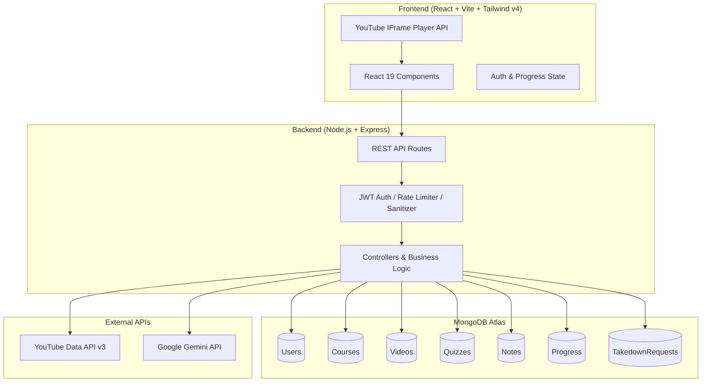

# FocusLearn 🎓

> **Transform YouTube Playlists into Structured, Distraction-Free Study Courses with AI Quizzes & Notes.**

FocusLearn is an educational Learning Management System (LMS) that turns any public YouTube playlist into a personalized, focused course workspace. It eliminates distractions, automatically verifies embed permissions, generates interactive AI-powered multiple-choice quizzes using Google Gemini, provides timestamp-synced markdown study notes, tracks daily study streaks, and upholds creator copyright compliance.

---

## 🌟 Key Features

- 📺 **1-Click Playlist Ingestion**: Paste any public YouTube playlist URL to automatically extract metadata, organize lessons in order, and calculate total runtime.
- 🛡️ **Legal & Creator Compliant**: Streams videos strictly via YouTube's official IFrame Player API. Non-embeddable videos are flagged, views/ad revenue flow to creators, and a dedicated **Creator Takedown Portal** allows rapid content removal.
- 🎯 **Distraction-Free Study Workspace**: Clean split-panel layout without YouTube comments, algorithmic recommendations, or sidebar distractions.
- 🤖 **AI-Powered Quiz Generation**: Instant 5-question multiple-choice quizzes generated by **Google Gemini AI** tailored to the lesson topic with instant grading, question jumper, and educational explanations.
- 📝 **Timestamp-Synced Markdown Notes**: Rich markdown editor with live player time synchronization, instant timestamp seeking, search filters, and Markdown export.
- 📊 **Progress & Analytics Hub**: Real-time tracking of platform completion, weekly study hour goals, interactive streak calendar with milestone badges, and course resume capabilities.
- 🔐 **Secure & Production-Ready**: JWT Bearer token authentication, NoSQL injection sanitization, rate-limiting, and Helmet security headers.

---

## 🏗️ Architecture



---

## 💻 Tech Stack

| Layer | Technologies |
|---|---|
| **Frontend** | React 19, Vite, Tailwind CSS v4, Lucide Icons, Axios, React Router v7 |
| **Backend** | Node.js, Express.js, Mongoose ODM, JSONWebToken, BcryptJS, Helmet |
| **Database** | MongoDB Atlas (Cloud) / Local MongoDB |
| **AI Engine** | Google Gemini API (`@google/genai`) |
| **Video Engine** | YouTube Data API v3 & YouTube IFrame Player API |
| **Deployment** | Vercel (Frontend) + Render (Backend) |

---

## 📁 Project Structure

```
Focuslearn/
├── client/                           # Frontend React (Vite) Application
│   ├── src/
│   │   ├── components/
│   │   │   ├── course/               # CourseCard, ModuleList, CreatorAttribution
│   │   │   ├── layout/               # Navbar, Footer, LegalDisclaimer
│   │   │   ├── notes/                # NoteEditor, NoteList, MarkdownViewer
│   │   │   ├── player/               # YouTubePlayer (IFrame API wrapper)
│   │   │   ├── progress/             # CompletionRing, StreakTracker, GoalSetter
│   │   │   ├── quiz/                 # QuizPanel (Interactive AI MCQs)
│   │   │   └── ui/                   # Button, Input, Card, Modal, Loader
│   │   ├── context/                  # AuthContext (JWT state & persistence)
│   │   ├── pages/                    # Home, Login, Register, Dashboard, Study, Progress, Takedown
│   │   ├── services/                 # Axios API service client
│   │   └── index.css                 # Tailwind v4 theme design tokens
│   ├── vercel.json                   # SPA routing rewrites for Vercel
│   └── vite.config.js
│
├── server/                           # Backend Express REST API
│   ├── src/
│   │   ├── config/                   # db.js (MongoDB), env.js (Validation)
│   │   ├── controllers/              # auth, course, quiz, note, progress, takedown
│   │   ├── middleware/               # auth.js, errorHandler.js, rateLimiter.js, sanitize.js
│   │   ├── models/                   # User, Course, Video, Quiz, Note, Progress, TakedownRequest
│   │   ├── routes/                   # API endpoint route definitions
│   │   ├── services/                 # geminiService.js, youtubeService.js
│   │   └── utils/                    # youtubeHelpers.js, apiResponse.js
│   ├── server.js                     # Server entry point
│   └── package.json
│
├── deployment.md                     # Step-by-step Vercel & Render deployment guide
├── phase.md                          # Milestone tracker
└── README.md
```

---

## 🚀 Getting Started

### Prerequisites

Ensure you have the following installed:
- [Node.js](https://nodejs.org/) (v18.0.0 or higher)
- [npm](https://www.npmjs.com/) (v9.0.0 or higher)
- [MongoDB](https://www.mongodb.com/) (Local instance or MongoDB Atlas cluster URI)
- **Google Cloud Console API Key** (with YouTube Data API v3 enabled)
- **Google AI Studio API Key** (for Gemini AI quiz generation)

---

### 1. Clone the Repository

```bash
git clone https://github.com/your-username/focuslearn.git
cd focuslearn
```

---

### 2. Backend Setup

1. Navigate to the `server/` directory:
   ```bash
   cd server
   ```
2. Install server dependencies:
   ```bash
   npm install
   ```
3. Create a `.env` configuration file in `server/.env`:
   ```env
   PORT=5000
   NODE_ENV=development
   MONGODB_URI=mongodb://127.0.0.1:27017/focuslearn
   JWT_SECRET=your_super_secret_jwt_key_min_32_characters
   YOUTUBE_API_KEY=your_google_cloud_youtube_api_key
   GEMINI_API_KEY=your_google_ai_studio_gemini_key
   CLIENT_URL=http://localhost:5173
   ```
4. Start the backend development server:
   ```bash
   npm run dev
   ```
   *The server will boot on `http://localhost:5000`.*

---

### 3. Frontend Setup

1. Open a new terminal and navigate to the `client/` directory:
   ```bash
   cd client
   ```
2. Install client dependencies:
   ```bash
   npm install
   ```
3. Create a `.env` file in `client/.env`:
   ```env
   VITE_API_URL=http://localhost:5000/api
   ```
4. Start the Vite development server:
   ```bash
   npm run dev
   ```
   *Open `http://localhost:5173` in your browser to view the application.*

---

## 📡 REST API Reference

| Method | Endpoint | Description | Auth Required |
|---|---|---|---|
| **POST** | `/api/auth/register` | Register a new user | No |
| **POST** | `/api/auth/login` | Log in and receive JWT | No |
| **GET** | `/api/auth/me` | Fetch authenticated user profile | ✅ Yes |
| **POST** | `/api/courses` | Import YouTube playlist into course | ✅ Yes |
| **GET** | `/api/courses` | List enrolled courses | ✅ Yes |
| **GET** | `/api/courses/:id` | Get course details with video modules | ✅ Yes |
| **DELETE** | `/api/courses/:id` | Remove enrolled course | ✅ Yes |
| **POST** | `/api/quizzes/generate/:videoId` | Generate AI quiz for video via Gemini | ✅ Yes |
| **GET** | `/api/quizzes/:videoId` | Get existing quiz for video | ✅ Yes |
| **POST** | `/api/quizzes/:quizId/submit` | Grade MCQ answers & record score | ✅ Yes |
| **POST** | `/api/notes` | Create timestamped markdown note | ✅ Yes |
| **GET** | `/api/notes/:videoId` | Fetch user notes for video | ✅ Yes |
| **PUT** | `/api/notes/:id` | Update note content or timestamp | ✅ Yes |
| **DELETE** | `/api/notes/:id` | Delete note | ✅ Yes |
| **GET** | `/api/progress/dashboard` | Aggregated analytics & streak stats | ✅ Yes |
| **GET** | `/api/progress/:courseId` | Course-specific progress data | ✅ Yes |
| **PUT** | `/api/progress/:courseId` | Update completed videos, time, position | ✅ Yes |
| **POST** | `/api/takedown` | Submit creator takedown request | No (Rate-limited) |
| **GET** | `/api/takedown` | List review queue | ✅ Yes |
| **PUT** | `/api/takedown/:id` | Approve/reject request & deactivate course | ✅ Yes |
| **GET** | `/api/health` | Service health status check | No |

---

## 🚢 Production Deployment

FocusLearn is preconfigured for zero-friction cloud deployment:
- **Backend on Render**: Web Service with Node.js runtime and environment variables.
- **Frontend on Vercel**: Vite SPA preset with `vercel.json` rewrite routing.

👉 **Follow the full guide in [deployment.md](deployment.md)**.

---

## ⚖️ Legal & YouTube Terms of Service Compliance

- **No Video Hosting**: FocusLearn does not download, re-encode, or host video files. All media is streamed live via YouTube's official IFrame Player API.
- **Creator Attribution**: Every lesson features prominent channel branding, creator name, and direct "Watch on YouTube" links.
- **Embed Permissions**: Video embeddability is verified on ingestion. Videos with embedding disabled by the creator are respected.
- **Takedown Portal**: Copyright holders can request removal of content at `/takedown` with automated course deactivation upon review.
- Reference: [YouTube Terms of Service](https://www.youtube.com/t/terms) & [YouTube Developer Policies](https://developers.google.com/youtube/terms/developer-policies).

---

## 📄 License

This project is licensed under the **MIT License** — see the LICENSE file for details.
