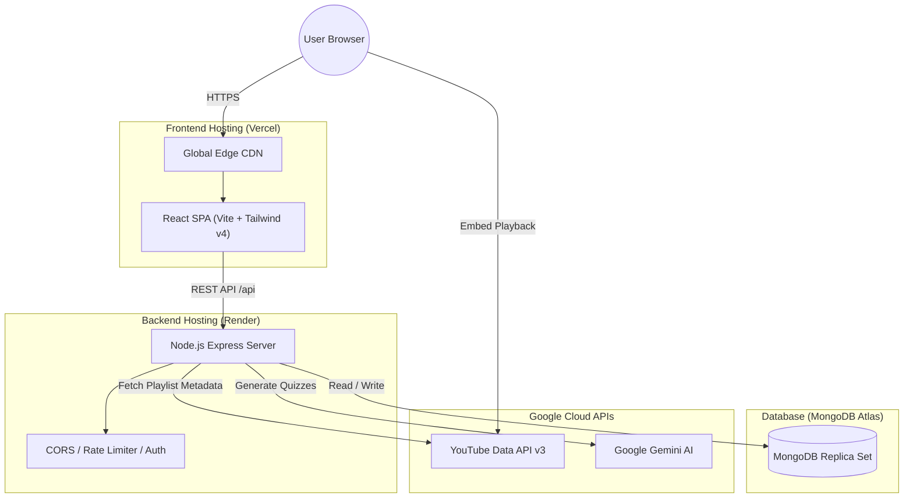

# FocusLearn — Production Deployment Guide (Vercel + Render)

This guide provides step-by-step instructions for deploying the **FocusLearn** full-stack application to production:
- **Frontend**: Hosted on [Vercel](https://vercel.com) (Vite + React SPA)
- **Backend**: Hosted on [Render](https://render.com) (Node.js + Express REST API)
- **Database**: Hosted on [MongoDB Atlas](https://www.mongodb.com/cloud/atlas) (Managed Cloud MongoDB)
- **External AI & Video Services**: Google Gemini API & YouTube Data API v3

---

## 🏗️ Architecture Overview



---

## 📋 Pre-Deployment Checklist

Before starting, ensure you have the following accounts and credentials ready:

| Resource | Service | Purpose | Free Tier Available? |
|---|---|---|---|
| **Code Repository** | [GitHub](https://github.com) | Source code version control | ✅ Yes |
| **Backend Web Service** | [Render](https://render.com) | Node.js Express server execution | ✅ Yes |
| **Frontend Static Host** | [Vercel](https://vercel.com) | React SPA hosting & edge caching | ✅ Yes |
| **Cloud Database** | [MongoDB Atlas](https://www.mongodb.com/cloud/atlas) | Document storage for courses, users, notes | ✅ Yes (M0 Free Cluster) |
| **YouTube API** | [Google Cloud Console](https://console.cloud.google.com) | Fetching playlist & video metadata | ✅ Yes (10,000 units/day) |
| **Gemini AI API** | [Google AI Studio](https://aistudio.google.com) | Generating educational MCQ quizzes | ✅ Yes (Free tier) |

---

## Step 1: MongoDB Atlas Database Setup

1. **Log in / Sign Up** at [MongoDB Atlas](https://www.mongodb.com/cloud/atlas).
2. **Create a Database Cluster**:
   - Select **M0 Free Cluster** (Shared).
   - Choose a cloud provider and region closest to your users (e.g., `AWS - Frankfurt` or `AWS - N. Virginia`).
   - Click **Create Cluster**.
3. **Create Database User Credentials**:
   - Go to **Security** → **Database Access**.
   - Click **Add New Database User**.
   - Set **Authentication Method**: Password.
   - Enter a username (e.g., `focuslearn_admin`) and a secure password.
   - Set **Database User Privileges**: `Read and write to any database`.
   - Click **Add User**.
4. **Configure Network Access**:
   - Go to **Security** → **Network Access**.
   - Click **Add IP Address**.
   - Select **Allow Access From Anywhere** (`0.0.0.0/0`) so that Render server instances can connect to the database.
   - Click **Confirm**.
5. **Get Connection String**:
   - Go to **Database** → **Clusters** → Click **Connect**.
   - Choose **Drivers** (Node.js).
   - Copy the connection URI. It will look like:
     ```
     mongodb+srv://focuslearn_admin:<password>@cluster0.abcde.mongodb.net/focuslearn?retryWrites=true&w=majority&appName=Cluster0
     ```
   - Replace `<password>` with your database user password and specify `/focuslearn` as the database name.

---

## Step 2: Google Cloud & Gemini API Keys Setup

### 2.1 YouTube Data API v3 Key
1. Go to the [Google Cloud Console](https://console.cloud.google.com/).
2. Create a new project or select an existing one (e.g., `FocusLearn`).
3. In the search bar, search for **YouTube Data API v3** and click **Enable**.
4. Go to **APIs & Services** → **Credentials**.
5. Click **Create Credentials** → **API Key**.
6. Copy the generated key (`YOUTUBE_API_KEY`).
7. *(Recommended)* Click **Edit API Key** and set API restrictions to **YouTube Data API v3**.

### 2.2 Google Gemini AI API Key
1. Go to [Google AI Studio](https://aistudio.google.com/).
2. Log in with your Google account.
3. Click **Get API Key** → **Create API Key in new project**.
4. Copy the API key string (`GEMINI_API_KEY`).

---

## Step 3: Deploy Backend on Render

Render hosts the Node.js Express backend and runs database migrations automatically upon server start.

### 3.1 Push Code to GitHub
Ensure your latest codebase is pushed to your GitHub repository:
```bash
git add .
git commit -m "Prepare FocusLearn for production deployment"
git push origin main
```

### 3.2 Create Render Web Service
1. Log in to [Render Dashboard](https://dashboard.render.com/).
2. Click **New +** → Select **Web Service**.
3. Connect your GitHub account and select your **Focuslearn** repository.
4. Fill in the service configuration details:

| Field | Configuration Value |
|---|---|
| **Name** | `focuslearn-api` (or any preferred name) |
| **Region** | Select region closest to your MongoDB Atlas cluster |
| **Branch** | `main` |
| **Root Directory** | `server` |
| **Runtime** | `Node` |
| **Build Command** | `npm install` |
| **Start Command** | `node server.js` |
| **Instance Type** | `Free` (or Starter for 0 cold-starts) |

### 3.3 Add Environment Variables on Render
Scroll down to the **Environment Variables** section and add the following keys:

| Key | Value | Description |
|---|---|---|
| `NODE_ENV` | `production` | Enables production optimizations |
| `PORT` | `10000` | Render defaults to port 10000 |
| `MONGODB_URI` | `mongodb+srv://...` | Connection URI from Step 1 |
| `JWT_SECRET` | `<your-secure-random-secret>` | Secret key for signing JWT tokens (min 32 chars) |
| `YOUTUBE_API_KEY` | `<your-google-cloud-api-key>` | Key from Step 2.1 |
| `GEMINI_API_KEY` | `<your-gemini-api-key>` | Key from Step 2.2 |
| `CLIENT_URL` | `http://localhost:5173` | *Temporary placeholder* (Update after Vercel deployment) |

5. Click **Create Web Service**.
6. Wait 1-2 minutes for Render to build and start your application.
7. Once deployed, note down your Render service URL (e.g., `https://focuslearn-api.onrender.com`).

### 3.4 Verify Backend Health
Open a browser or terminal and test the health check endpoint:
```bash
curl https://focuslearn-api.onrender.com/api/health
```
**Expected Response:**
```json
{
  "success": true,
  "message": "FocusLearn API is running",
  "timestamp": "2026-09-23T...",
  "environment": "production"
}
```

---

## Step 4: Deploy Frontend on Vercel

Vercel will build and host the Vite + React client with edge distribution.

### 4.1 Verify Vercel SPA Routing Configuration
A `client/vercel.json` file is already in your repository with the following rewrite rule:
```json
{
  "rewrites": [
    {
      "source": "/(.*)",
      "destination": "/index.html"
    }
  ]
}
```
> [!NOTE]
> This ensures client-side routing (React Router) works seamlessly when users reload pages such as `/dashboard`, `/progress`, or `/course/:id`.

### 4.2 Import Project in Vercel
1. Log in to [Vercel](https://vercel.com).
2. Click **Add New...** → **Project**.
3. Import your **Focuslearn** GitHub repository.
4. Configure the Project Settings:

| Setting | Value |
|---|---|
| **Project Name** | `focuslearn` |
| **Framework Preset** | `Vite` |
| **Root Directory** | Click **Edit** → select `client` → click **Continue** |
| **Build Command** | `npm run build` |
| **Output Directory** | `dist` |
| **Install Command** | `npm install` |

### 4.3 Configure Frontend Environment Variables
In the **Environment Variables** section on Vercel, add:

| Key | Value | Example |
|---|---|---|
| `VITE_API_URL` | `<Your Render API Base URL>/api` | `https://focuslearn-api.onrender.com/api` |

5. Click **Deploy**.
6. Vercel will build the React application and provide your live URL (e.g., `https://focuslearn.vercel.app`).

---

## Step 5: Connect Frontend and Backend (CORS Synchronization)

Now that your frontend has a live production URL, update your Render backend so that requests from your Vercel domain are authorized by CORS.

1. Go back to your [Render Dashboard](https://dashboard.render.com).
2. Select your `focuslearn-api` web service.
3. Navigate to **Environment** settings.
4. Edit the `CLIENT_URL` variable:
   - **Key**: `CLIENT_URL`
   - **Value**: `https://focuslearn.vercel.app` *(Your actual Vercel domain without trailing slash)*
5. Click **Save Changes**. Render will automatically trigger a zero-downtime redeploy.

---

## Step 6: End-to-End Verification Checklist

Perform this smoke test on your live production site:

- [ ] **1. Public Pages**: Visit `https://focuslearn.vercel.app` — check home page rendering and legal footer.
- [ ] **2. User Registration**: Create a new account at `/register`. Verify successful JWT token issuance and redirect to `/dashboard`.
- [ ] **3. User Login / Logout**: Log out and log back in at `/login`.
- [ ] **4. YouTube Playlist Import**:
  - Click **Import Playlist** on `/dashboard`.
  - Paste a public playlist URL (e.g. `https://www.youtube.com/playlist?list=PL4cUxeGkcC9gC88BEo9BZfiDP59iNP_Ur`).
  - Verify course metadata and video modules are ingested.
- [ ] **5. Study Session & Player**:
  - Open the imported course and launch `/study/:courseId`.
  - Check YouTube player playback and creator attribution bar.
  - Verify timestamp seeking by clicking note timestamps.
- [ ] **6. AI Quiz Generation**:
  - Open the **AI Quiz** tab on `/study/:courseId`.
  - Click **Generate AI Quiz** and verify questions generated by Gemini.
  - Submit answers and verify graded score and explanations.
- [ ] **7. Notes Module**:
  - Write a markdown note at the current video timestamp.
  - Verify the note is saved and visible in the list.
- [ ] **8. Analytics & Streaks**:
  - Visit `/progress`.
  - Verify study streak, weekly goals, completion percentage, and course breakdown.
- [ ] **9. Creator Takedown Portal**:
  - Visit `/takedown`.
  - Submit a test request and verify reference ID confirmation.
  - Switch to the **Review Portal** tab to inspect requests.

---

## 🛠️ Troubleshooting & FAQ

### 1. CORS Errors (`Access to XMLHttpRequest blocked by CORS policy`)
- **Cause**: The `CLIENT_URL` environment variable on Render does not match your Vercel domain.
- **Fix**: Ensure `CLIENT_URL` on Render is exactly `https://your-app.vercel.app` (must include `https://` and must **NOT** have a trailing `/`).

### 2. Render Free Tier Cold Starts
- **Behavior**: On Render's Free tier, services spin down after 15 minutes of inactivity. The first request after sleep may take ~45–60 seconds to wake up.
- **Solution**:
  - Set up a free monitoring ping using [UptimeRobot](https://uptimerobot.com) to ping `https://your-api.onrender.com/api/health` every 10 minutes.
  - Or upgrade to Render Starter plan ($7/mo) for persistent uptime.

### 3. Client Page Refresh Returns 404
- **Cause**: Vercel web server trying to locate a static file matching the route path rather than routing through `index.html`.
- **Fix**: Ensure `client/vercel.json` contains the `rewrites` configuration and is committed to GitHub.

### 4. YouTube Quota Exceeded (`quotaExceeded`)
- **Cause**: Google Cloud limits free tier to 10,000 quota units per day. (Playlist ingestion uses ~5 units).
- **Fix**: Apply for a YouTube API quota extension in Google Cloud Console if high traffic is expected.

### 5. Gemini AI Rate Limits
- **Cause**: Free tier allows up to 15 requests per minute (RPM).
- **Fix**: The backend is preconfigured with an AI rate limiter (10 req/15 min per IP) and exponential backoff retry.

---

## 🔐 Production Security Best Practices

1. **Rotate `JWT_SECRET`**: Use a cryptographically secure 64-character hex string:
   ```bash
   node -e "console.log(require('crypto').randomBytes(32).toString('hex'))"
   ```
2. **MongoDB IP Allowlist**: If using paid VPC or dedicated IP peering, restrict MongoDB Atlas network access to Render outbound IPs.
3. **Custom Domain with SSL**:
   - Both Vercel and Render provide automatic free SSL certificates (Let's Encrypt) when adding custom domains (e.g. `app.yourdomain.com` and `api.yourdomain.com`).
