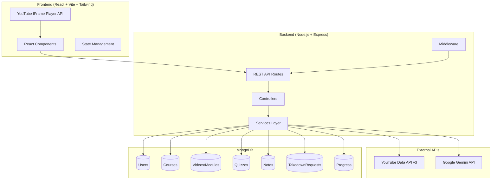

# FocusLearn — Personalized LMS Implementation Plan

A distraction-free Learning Management System that converts YouTube educational playlists into structured study courses, built on the MERN stack with AI-powered quiz generation.

---

## Architecture Overview



---

## Project Directory Structure

```
d:\Project\Focuslearn\
├── server/                          # Express.js Backend
│   ├── src/
│   │   ├── config/
│   │   │   ├── db.js                # MongoDB/Mongoose connection
│   │   │   └── env.js               # Environment variable loader
│   │   ├── models/
│   │   │   ├── User.js
│   │   │   ├── Course.js
│   │   │   ├── Video.js
│   │   │   ├── Quiz.js
│   │   │   ├── Note.js
│   │   │   ├── Progress.js
│   │   │   └── TakedownRequest.js
│   │   ├── controllers/
│   │   │   ├── authController.js
│   │   │   ├── courseController.js
│   │   │   ├── videoController.js
│   │   │   ├── quizController.js
│   │   │   ├── noteController.js
│   │   │   ├── progressController.js
│   │   │   └── takedownController.js
│   │   ├── services/
│   │   │   ├── youtubeService.js     # YouTube Data API v3 integration
│   │   │   ├── geminiService.js      # Google Gemini AI integration
│   │   │   └── quizService.js        # Quiz generation logic
│   │   ├── routes/
│   │   │   ├── authRoutes.js
│   │   │   ├── courseRoutes.js
│   │   │   ├── videoRoutes.js
│   │   │   ├── quizRoutes.js
│   │   │   ├── noteRoutes.js
│   │   │   ├── progressRoutes.js
│   │   │   └── takedownRoutes.js
│   │   ├── middleware/
│   │   │   ├── auth.js               # JWT authentication
│   │   │   ├── errorHandler.js       # Global error handler
│   │   │   └── rateLimiter.js        # API rate limiting
│   │   ├── utils/
│   │   │   ├── youtubeHelpers.js     # URL parsing, ID extraction
│   │   │   └── apiResponse.js        # Standardized response wrapper
│   │   └── app.js                    # Express app setup
│   ├── server.js                     # Entry point
│   ├── package.json
│   └── .env.example
│
├── client/                           # React (Vite) Frontend
│   ├── src/
│   │   ├── components/
│   │   │   ├── layout/
│   │   │   │   ├── Navbar.jsx
│   │   │   │   ├── Sidebar.jsx
│   │   │   │   ├── Footer.jsx
│   │   │   │   └── LegalDisclaimer.jsx
│   │   │   ├── player/
│   │   │   │   ├── YouTubePlayer.jsx
│   │   │   │   └── PlayerControls.jsx
│   │   │   ├── course/
│   │   │   │   ├── CourseCard.jsx
│   │   │   │   ├── CourseList.jsx
│   │   │   │   ├── ModuleList.jsx
│   │   │   │   └── CreatorAttribution.jsx
│   │   │   ├── quiz/
│   │   │   │   ├── QuizPanel.jsx
│   │   │   │   └── QuizQuestion.jsx
│   │   │   ├── notes/
│   │   │   │   ├── NoteEditor.jsx
│   │   │   │   └── NoteList.jsx
│   │   │   ├── progress/
│   │   │   │   ├── ProgressBar.jsx
│   │   │   │   ├── StreakTracker.jsx
│   │   │   │   └── GoalSetter.jsx
│   │   │   ├── takedown/
│   │   │   │   └── TakedownForm.jsx
│   │   │   └── ui/                   # Reusable UI primitives
│   │   │       ├── Button.jsx
│   │   │       ├── Input.jsx
│   │   │       ├── Modal.jsx
│   │   │       ├── Card.jsx
│   │   │       └── Loader.jsx
│   │   ├── pages/
│   │   │   ├── HomePage.jsx
│   │   │   ├── DashboardPage.jsx
│   │   │   ├── CoursePage.jsx
│   │   │   ├── StudyPage.jsx
│   │   │   ├── QuizPage.jsx
│   │   │   ├── ProgressPage.jsx
│   │   │   ├── TakedownPage.jsx
│   │   │   ├── LoginPage.jsx
│   │   │   └── RegisterPage.jsx
│   │   ├── hooks/
│   │   │   ├── useYouTubePlayer.js
│   │   │   ├── useAuth.js
│   │   │   └── useCourse.js
│   │   ├── context/
│   │   │   └── AuthContext.jsx
│   │   ├── services/
│   │   │   └── api.js                # Axios instance + API helpers
│   │   ├── styles/
│   │   │   └── design-tokens.css     # Design system tokens
│   │   ├── utils/
│   │   │   └── formatters.js
│   │   ├── App.jsx
│   │   ├── main.jsx
│   │   └── index.css
│   ├── index.html
│   ├── vite.config.js
│   ├── package.json
│   └── .env.example
│
├── phase.md                          # Progress tracking file
└── README.md
```

---

## Phase 1: Backend Architecture, Database Schema & Legal Guardrails

### 1.1 Server & Project Scaffolding

#### [NEW] `server/package.json`
Initialize Node.js project with dependencies:
- **Runtime**: `express`, `cors`, `dotenv`, `helmet`, `morgan`, `express-rate-limit`
- **Database**: `mongoose`
- **Auth**: `bcryptjs`, `jsonwebtoken`
- **External APIs**: `axios` (YouTube Data API calls), `@google/genai` (Gemini)
- **Dev**: `nodemon`

#### [NEW] `server/server.js`
Entry point — boots Express app, connects to MongoDB, starts listening on port from env.

#### [NEW] `server/src/app.js`
Express app configuration:
- CORS (allow frontend origin)
- JSON body parser
- Helmet security headers
- Morgan request logging
- Rate limiter middleware
- Mount all route groups
- Global error handler middleware

#### [NEW] `server/src/config/db.js`
Mongoose connection with retry logic and connection event logging.

#### [NEW] `server/src/config/env.js`
Centralized env variable loading and validation for: `PORT`, `MONGODB_URI`, `JWT_SECRET`, `YOUTUBE_API_KEY`, `GEMINI_API_KEY`, `CLIENT_URL`.

---

### 1.2 Mongoose Schemas (Database Models)

#### [NEW] `server/src/models/User.js`
| Field | Type | Notes |
|---|---|---|
| `name` | String | required |
| `email` | String | required, unique, indexed |
| `passwordHash` | String | select: false |
| `avatar` | String | optional URL |
| `enrolledCourses` | [ObjectId → Course] | ref array |
| `studyStreak` | Number | default: 0 |
| `lastStudyDate` | Date | nullable |
| `timestamps` | auto | createdAt, updatedAt |

Pre-save hook: hash password with bcryptjs. Instance method: `comparePassword()`.

#### [NEW] `server/src/models/Course.js`
| Field | Type | Notes |
|---|---|---|
| `title` | String | required |
| `description` | String | from playlist |
| `playlistId` | String | required, unique, indexed |
| `playlistUrl` | String | required |
| `thumbnailUrl` | String | playlist thumbnail |
| `channelTitle` | String | required (attribution) |
| `channelId` | String | required |
| `channelUrl` | String | computed |
| `totalVideos` | Number | count |
| `totalDuration` | String | aggregated |
| `videos` | [ObjectId → Video] | ref array |
| `createdBy` | ObjectId → User | who imported it |
| `isActive` | Boolean | default: true (for takedowns) |
| `timestamps` | auto | |

#### [NEW] `server/src/models/Video.js`
| Field | Type | Notes |
|---|---|---|
| `title` | String | required |
| `description` | String | from API |
| `videoId` | String | required, indexed |
| `courseId` | ObjectId → Course | required |
| `position` | Number | order in playlist |
| `duration` | String | ISO 8601 duration |
| `durationSeconds` | Number | computed for sorting |
| `thumbnailUrl` | String | |
| `channelTitle` | String | creator attribution |
| `channelId` | String | |
| `isEmbeddable` | Boolean | **legal compliance** |
| `publishedAt` | Date | |
| `timestamps` | auto | |

#### [NEW] `server/src/models/Quiz.js`
| Field | Type | Notes |
|---|---|---|
| `videoId` | ObjectId → Video | required |
| `courseId` | ObjectId → Course | required |
| `questions` | [QuestionSubdoc] | embedded array |
| `generatedBy` | String | "gemini" |
| `timestamps` | auto | |

**QuestionSubdoc schema:**
| Field | Type |
|---|---|
| `question` | String |
| `options` | [String] (4 items) |
| `correctAnswer` | Number (0-3 index) |
| `explanation` | String |

#### [NEW] `server/src/models/Note.js`
| Field | Type | Notes |
|---|---|---|
| `userId` | ObjectId → User | required |
| `videoId` | ObjectId → Video | required |
| `courseId` | ObjectId → Course | required |
| `content` | String | markdown text |
| `timestamp` | Number | video seconds |
| `timestamps` | auto | |

#### [NEW] `server/src/models/Progress.js`
| Field | Type | Notes |
|---|---|---|
| `userId` | ObjectId → User | required |
| `courseId` | ObjectId → Course | required |
| `completedVideos` | [ObjectId → Video] | ref array |
| `quizScores` | [{ quizId, score, total, date }] | embedded |
| `currentVideoId` | ObjectId → Video | last watched |
| `currentTimestamp` | Number | playback position |
| `completionPercent` | Number | 0-100 |
| `goalHoursPerWeek` | Number | user-set study goal |
| `studyTimeMinutes` | Number | total accumulated |
| `timestamps` | auto | |

Compound index on `{ userId, courseId }` for unique constraint.

#### [NEW] `server/src/models/TakedownRequest.js`
| Field | Type | Notes |
|---|---|---|
| `requesterName` | String | required |
| `requesterEmail` | String | required |
| `channelUrl` | String | required |
| `playlistUrl` | String | optional |
| `reason` | String | required |
| `status` | String | enum: pending, approved, rejected |
| `adminNotes` | String | internal |
| `timestamps` | auto | |

---

### 1.3 Middleware & Utilities

#### [NEW] `server/src/middleware/auth.js`
JWT verification middleware — extracts token from `Authorization: Bearer <token>` header, verifies with `JWT_SECRET`, attaches `req.user`.

#### [NEW] `server/src/middleware/errorHandler.js`
Global error handler: catches Mongoose validation errors, duplicate key errors, JWT errors, and custom API errors. Returns standardized JSON response.

#### [NEW] `server/src/middleware/rateLimiter.js`
Express-rate-limit configuration: general limiter (100 req/15min), auth limiter (20 req/15min).

#### [NEW] `server/src/utils/youtubeHelpers.js`
- `extractPlaylistId(url)` — regex parser for YouTube playlist URLs
- `parseDuration(iso8601)` — converts `PT1H2M3S` to seconds
- `formatDuration(seconds)` — converts seconds to `HH:MM:SS`

#### [NEW] `server/src/utils/apiResponse.js`
Standardized response helper: `success(res, data, statusCode)` and `error(res, message, statusCode)`.

#### [NEW] `server/src/services/youtubeService.js`
YouTube Data API v3 wrapper:
- `fetchPlaylistDetails(playlistId)` — get playlist title, description, thumbnail
- `fetchPlaylistItems(playlistId)` — paginated fetch of all video IDs (handles `nextPageToken`)
- `fetchVideoDetails(videoIds[])` — batch fetch (up to 50 per call) returning snippet, contentDetails, status
- **Embed permission check**: reads `status.embeddable` boolean for each video

---

### 1.4 Auth Routes (Phase 1 Scope)

#### [NEW] `server/src/routes/authRoutes.js` + `server/src/controllers/authController.js`
| Method | Endpoint | Description |
|---|---|---|
| POST | `/api/auth/register` | Create user, return JWT |
| POST | `/api/auth/login` | Validate credentials, return JWT |
| GET | `/api/auth/me` | Get current user (protected) |

---

### 1.5 Frontend Scaffolding (Phase 1)

#### [NEW] `client/` (Vite + React + Tailwind CSS v4)
Scaffold with `npm create vite@latest` → React JavaScript template. Install Tailwind CSS v4 with `@tailwindcss/vite` plugin. Install routing (`react-router-dom`), icons (`lucide-react`), HTTP client (`axios`).

#### [NEW] `client/src/styles/design-tokens.css`
Establish the design system:
- **Color palette**: Deep navy/slate backgrounds, electric blue/cyan accents, warm amber highlights
- **Typography**: Inter (Google Fonts) — weights 400, 500, 600, 700
- **Spacing scale**, border radii, shadows, transition timings
- **Dark mode** as default theme

#### [NEW] `client/src/index.css`
Import Tailwind + design tokens. Custom base layer styles.

#### [NEW] Placeholder pages & routing
Minimal page shells for `HomePage`, `LoginPage`, `RegisterPage`, `DashboardPage` wired through `react-router-dom`.

---

## Phase 2: YouTube Playlist Parser & Distraction-Free LMS UI

### 2.1 Backend — Playlist Ingestion

#### [NEW] `server/src/routes/courseRoutes.js` + `server/src/controllers/courseController.js`
| Method | Endpoint | Description |
|---|---|---|
| POST | `/api/courses` | Ingest playlist URL → create Course + Videos |
| GET | `/api/courses` | List user's enrolled courses |
| GET | `/api/courses/:id` | Get course with populated videos |
| DELETE | `/api/courses/:id` | Remove course (soft delete) |

**Ingestion flow:**
1. Extract playlist ID from URL via `youtubeHelpers`
2. Call `youtubeService.fetchPlaylistDetails()` for metadata
3. Call `youtubeService.fetchPlaylistItems()` for all video IDs
4. Call `youtubeService.fetchVideoDetails()` in batches of 50
5. Check `status.embeddable` for each video — flag non-embeddable
6. Create `Course` document + bulk-insert `Video` documents
7. Link video ObjectIds to course

### 2.2 Frontend — Study Dashboard & Player

#### [NEW] Course import flow
- Input field for YouTube playlist URL on dashboard
- Loading state with progress indicator during ingestion
- Error handling for invalid URLs, private playlists, API errors

#### [NEW] `client/src/components/player/YouTubePlayer.jsx`
YouTube IFrame Player API wrapper:
- Load IFrame API script dynamically
- Initialize player with `playerVars: { rel: 0, autoplay: 0, controls: 1 }`
- Expose play/pause/seek callbacks via custom hook
- **Distraction-free**: no annotations, rel=0 for same-channel only recommendations

#### [NEW] `client/src/pages/StudyPage.jsx`
Split-panel layout:
- **Left (70%)**: YouTube player + player controls
- **Right (30%)**: Module/video list sidebar with completion checkmarks
- Below player: Creator attribution bar, notes panel, quiz trigger

#### [NEW] `client/src/components/course/CreatorAttribution.jsx`
Prominent display of:
- Channel name (linked to YouTube channel)
- Channel avatar/thumbnail
- "Watch on YouTube" direct link
- Source badge

---

## Phase 3: AI Quiz Generation & Notes Module

### 3.1 Backend — Gemini Quiz Service

#### [NEW] `server/src/services/geminiService.js`
Google Gemini API integration:
- Initialize `GoogleGenAI` with API key
- `generateQuiz(videoTitle, videoDescription)` — structured prompt requesting JSON array of 5 MCQs
- Parse and validate response structure
- Error handling for rate limits and malformed responses

#### [NEW] `server/src/routes/quizRoutes.js` + `server/src/controllers/quizController.js`
| Method | Endpoint | Description |
|---|---|---|
| POST | `/api/quizzes/generate/:videoId` | Generate quiz via Gemini |
| GET | `/api/quizzes/:videoId` | Get existing quiz |
| POST | `/api/quizzes/:quizId/submit` | Submit answers, return score |

### 3.2 Backend — Notes CRUD

#### [NEW] `server/src/routes/noteRoutes.js` + `server/src/controllers/noteController.js`
| Method | Endpoint | Description |
|---|---|---|
| POST | `/api/notes` | Create timestamped note |
| GET | `/api/notes/:videoId` | Get notes for a video |
| PUT | `/api/notes/:id` | Update note content |
| DELETE | `/api/notes/:id` | Delete note |

### 3.3 Frontend — Quiz & Notes UI

#### [NEW] Quiz panel
- Generate quiz button on study page
- Loading state during AI generation
- Interactive MCQ interface with option selection
- Score display with correct/incorrect explanations

#### [NEW] Notes editor
- Text editor with markdown support
- "Add note at current timestamp" button (reads player time)
- Notes list sorted by timestamp
- Click note → seeks player to timestamp

---

## Phase 4: Progress Tracking, Analytics & Takedown Portal

### 4.1 Backend — Progress & Takedown

#### [NEW] `server/src/routes/progressRoutes.js` + `server/src/controllers/progressController.js`
| Method | Endpoint | Description |
|---|---|---|
| GET | `/api/progress/:courseId` | Get user's course progress |
| PUT | `/api/progress/:courseId` | Update progress (mark video done, save position) |
| GET | `/api/progress/dashboard` | Aggregate stats across all courses |

#### [NEW] `server/src/routes/takedownRoutes.js` + `server/src/controllers/takedownController.js`
| Method | Endpoint | Description |
|---|---|---|
| POST | `/api/takedown` | Submit takedown request (public) |
| GET | `/api/takedown` | List requests (admin only) |
| PUT | `/api/takedown/:id` | Update status (admin only) |

### 4.2 Frontend — Analytics Dashboard & Takedown Form

#### [NEW] Progress dashboard
- Overall completion percentage rings
- Study streak counter with calendar heatmap
- Goal setting (hours/week) with progress bars
- Per-course progress breakdown

#### [NEW] Takedown form page
- Public-facing form (no auth required)
- Fields: name, email, channel URL, playlist URL, reason
- Confirmation toast on submission

---

## UI/UX Design System

### Color Palette
| Token | Value | Usage |
|---|---|---|
| `--bg-primary` | `#0f172a` (Slate 900) | Main background |
| `--bg-secondary` | `#1e293b` (Slate 800) | Cards, panels |
| `--bg-tertiary` | `#334155` (Slate 700) | Hover states |
| `--accent-primary` | `#3b82f6` (Blue 500) | Primary actions, links |
| `--accent-secondary` | `#06b6d4` (Cyan 500) | Secondary highlights |
| `--accent-warm` | `#f59e0b` (Amber 500) | Streaks, achievements |
| `--accent-success` | `#10b981` (Emerald 500) | Completion, success |
| `--accent-danger` | `#ef4444` (Red 500) | Errors, destructive |
| `--text-primary` | `#f8fafc` (Slate 50) | Main text |
| `--text-secondary` | `#94a3b8` (Slate 400) | Muted text |
| `--text-tertiary` | `#64748b` (Slate 500) | Placeholder text |

### Typography
- **Font Family**: `'Inter', system-ui, sans-serif`
- **Scale**: 12px / 14px / 16px / 18px / 20px / 24px / 30px / 36px / 48px
- **Weights**: 400 (regular), 500 (medium), 600 (semibold), 700 (bold)

### Design Principles
- Dark mode default with glassmorphism card effects
- Consistent 8px spacing grid
- Border radius: 8px (small), 12px (medium), 16px (large)
- Subtle box shadows with colored glow effects for active states
- Smooth 200ms transitions on all interactive elements
- Micro-animations: fade-in on mount, scale on hover, slide for sidebars

---

## User Review Required

> [!IMPORTANT]
> **API Keys Required**: You will need to provide:
> - `YOUTUBE_API_KEY` — from [Google Cloud Console](https://console.cloud.google.com/) with YouTube Data API v3 enabled
> - `GEMINI_API_KEY` — from [Google AI Studio](https://aistudio.google.com/)
> - `MONGODB_URI` — MongoDB Atlas connection string or local MongoDB
> - `JWT_SECRET` — any secure random string

> [!WARNING]
> **Tailwind CSS v4**: The user explicitly requested Tailwind CSS. We will use Tailwind CSS v4 with the Vite plugin (`@tailwindcss/vite`). This version does NOT require a `tailwind.config.js` file — configuration is done through CSS imports.

## Open Questions

> [!IMPORTANT]
> 1. **Authentication Scope**: Should we implement full email/password auth, or also include OAuth (Google Sign-In)?  The current plan assumes email/password with JWT only.
> 2. **MongoDB Hosting**: Are you using MongoDB Atlas (cloud) or a local MongoDB instance? This affects the connection string format.
> 3. **Admin Dashboard**: Should the takedown request management (approve/reject) have a dedicated admin UI, or is API-only management sufficient for now?
> 4. **Multi-User Courses**: Can multiple users import and enroll in the same playlist-based course (shared course), or does each user get their own isolated copy?

## Verification Plan

### Automated Tests
- Server boot test: `node server/server.js` starts without errors
- MongoDB connection test via Mongoose event listeners
- API endpoint smoke tests via manual curl/Postman requests
- Frontend dev server: `npm run dev` in client/ starts Vite server

### Manual Verification
- Import a public YouTube playlist and verify all videos are fetched
- Confirm non-embeddable videos are flagged correctly
- Test JWT auth flow (register → login → access protected routes)
- Verify Tailwind styles render correctly in the browser
- Test responsive layout across viewport sizes
